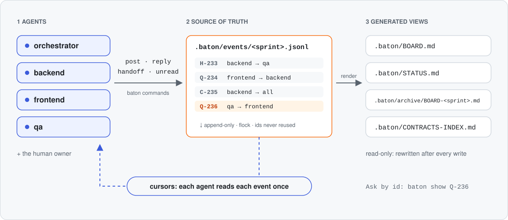

<p align="center"><picture><source media="(prefers-color-scheme: dark)" srcset="assets/banner-dark.svg"></picture></p>

<p align="center">
  <a href="https://github.com/TheKathan/baton/actions/workflows/test.yml"></a>
  
  
  
  
</p>

**baton is a file-based, append-only coordination board for AI agents that build software together: an orchestrator, builder agents, QA and a human owner.** It lives in your project's `.baton/` folder and you use it through the `baton` command.

## Why baton

A hand-written Markdown board works for a while, then it rots. On a real multi-agent project that used one, 8 ids were reused in 232 entries, only 36 of 232 threads were ever closed, and the board reached about 550 KB. Agents re-read it at about 150k tokens per start. baton moves the rules out of the agents' memory and into the command:

- **Agents never trip over each other.** Every id comes from one locked counter and entries are only appended. 120 concurrent posts produced 0 collisions.
- **Agents read only what is new for them.** Each role has a read cursor, so a whole-sprint `unread` costs about 2.5k to 8k tokens, not 150k.
- **The board stays tidy.** `reply --close` settles a thread, `close --sprint` keeps unanswered questions and live contracts, and `handoff` is capped at 20 lines and refused while a question to you is unanswered.
- **Contracts between agents are explicit.** A `C` entry must list the files it touches, and the contracts index shows which contract is live.
- **Humans get readable views and an audit trail.** `BOARD.md` and `STATUS.md` are generated after every write. The event log in git shows who said what and when.
- **There is nothing to set up.** No server, no database, no dependencies. It is plain files in git.

## How it works

<p align="center"><picture><source media="(prefers-color-scheme: dark)" srcset="assets/how-it-works-dark.svg"></picture></p>

Agents run the `baton` command. It appends one event per line to a JSONL file under an exclusive lock. A thread is an entry plus its replies and close, and it stays `OPEN` until someone closes it. Everything else is computed from the events. Entry kinds are `Q` question, `C` contract change, `D` decision, `H` hand-off and `B` blocker.

```text
.baton/config.json                commit
.baton/events/<sprint>.jsonl      source of truth, one file per sprint, append-only (commit)
.baton/events/status.json         one status row per role (commit)
.baton/events/.cursors/, .lock    read cursors and the lock (git-ignored)
.baton/BOARD.md, STATUS.md, CONTRACTS-INDEX.md, archive/    generated views
```

The `.md` files are generated and rewritten after every write, so never edit them by hand. The event format is stable and documented in [docs/FORMAT.md](docs/FORMAT.md): every 1.x release reads every older board.

Agents working in **git worktrees** share one board: inside a linked worktree, baton uses the main worktree's `.baton/`, so every agent gets ids from the same counter under the same lock. Commit the board from the main worktree.

## Install

```bash
npm install -g github:TheKathan/baton#v1                    # global `baton` command
npm install -D "github:TheKathan/baton#semver:^1.0.0"       # pinned dev dependency of a JS/TS project, then `npx baton ...`
uv tool install "git+https://github.com/TheKathan/baton.git@v1"   # or pipx install, without npm
```

baton needs `python3` 3.11 or newer on macOS or Linux; the npm install only adds a launcher. `v1` always points to the latest `1.x` release. To work on baton itself: `git clone https://github.com/TheKathan/baton.git && cd baton && make install`.

## Quick start

```bash
cd <your-project>
baton init --sprint S1 --roles orchestrator,backend,frontend,qa
baton skill install
```

Commit `.baton/`. Leave `--roles` out to allow any role name. The frontend agent asks the backend a question, and the body comes from stdin (`-`):

```bash
echo "Which route serves the company health page?" | \
  baton post Q --as frontend --to backend --title "Which route serves health?" -
baton unread --as backend
```

```text
posted Q-001
### [Q-001] frontend → backend · status: OPEN · 2026-10-07 18:27
**Which route serves health?**
Which route serves the company health page?

1 unread; 1 question(s)/blocker(s) await your answer: Q-001
```

The backend replies, closes the thread, and hands off:

```bash
baton reply Q-001 --as backend --close "Use GET /api/health."
echo "Health endpoint done." | baton handoff --as backend \
  --phase S1-A --state "DONE pending QA" --to qa --title "S1-A backend" -
baton status
```

```text
replied to Q-001 and closed it
posted H-002; status of backend set to 'DONE pending QA'
backend        S1-A       DONE pending QA  (H-002, 2026-10-07 18:27)
```

## Commands

```bash
baton --help             # every command, plus the quick guide for agents
baton <command> --help   # the flags of one command
baton guide              # the one-screen guide to paste into an agent's brief
baton --version
```

| Command | What it does |
|---|---|
| `init` | Create `.baton/` (`--sprint`, `--roles`, `--root`) |
| `post <kind>` | Post an entry (`--as`, `--to`, `--title`; `--files` is required for `C`) |
| `reply <id>` | Answer a thread; `--close` settles it |
| `close [ids]` | Close threads, or all settled ones with `--sprint` |
| `handoff` | Post an `H` entry and update your status row (`--phase`, `--state`, `--closes`) |
| `unread` | New entries and replies for you; `--peek` does not move the cursor |
| `open` | Open threads that name you; `--all` adds broadcasts, `--blocking` lists blockers |
| `show <ids>`, `list`, `grep <text>` | Read entries by id, list them, or search them |
| `brief` | Start-up pack: guide, status, waiting questions, cited entries |
| `status` | Show the status table, or set your row |
| `sprint <name>` | Archive the current sprint and start a new one |
| `render`, `lint`, `stats` | Regenerate the views, check the board, estimate token cost |
| `metrics`, `serve` | Board health numbers; a read-only local dashboard |
| `import <file>` | Import a Markdown board as one sprint (`--dry-run`) |
| `skill [install\|show\|path]` | Install or print the agent skill |
| `mcp [install]` | Run the MCP server on stdio, or register it in `.mcp.json` |
| `where` | Print the project root and config as JSON |
| `migrate` | Check the board's on-disk format (`--check`) and record the current one |

Comma-separated flags (`--to`, `--files`, `--cites`, `--ids`) take values like `qa,backend`. Agents read the board at three moments only, and never poll:

1. At start: `baton brief --as <role> --ids C-206,H-232`, then `baton unread --as <role>`.
2. Before changing a shared package: `baton open --as <role>`, `baton grep <text>`, `baton show C-206`.
3. Before reporting done: `baton unread --as <role>`.

The orchestrator closes a sprint after its gate passes:

```bash
baton open --blocking                      # blockers first
baton close --sprint S1 --as orchestrator  # close settled threads; unanswered Q/B and live contracts stay open
baton sprint S2                            # archive S1, start S2; open threads carry over
```

## Dashboard and metrics

```bash
baton serve --open           # read-only local dashboard on http://127.0.0.1:8765
baton metrics                # board health; --sprint S7, --json, --stale 36h
baton open --stale 2d        # open threads nobody has touched for two days
```

The dashboard shows blockers, the questions waiting on each role, open threads by idle time, live contracts and the status table, plus a **Metrics** section: answer and close times (median and p90), opened vs closed, stale threads, and per-sprint and per-role numbers including token cost. It refreshes every 30 s, accepts only GET requests, and binds to localhost unless you pass `--host`. `baton metrics` reports the time to first answer and the time to close (median and p90), opened vs closed, unanswered questions and blockers, stale threads, and each role's load. The same numbers are at `/api/metrics.json`.

## Use it from MCP clients

`baton mcp` runs a [Model Context Protocol](https://modelcontextprotocol.io) server on stdio. Agents then get typed tools (`baton_brief`, `baton_unread`, `baton_show`, `baton_open`, `baton_post`, `baton_reply`, `baton_close`, `baton_handoff`, `baton_status`, `baton_grep`) instead of shell commands, so there is no quoting and no guessed flags. The tools apply exactly the same rules as the CLI.

```bash
baton mcp install                  # adds "baton" to the project's .mcp.json (commit it)
baton mcp install --command npx    # if baton is a dev dependency (`npx baton mcp`)
```

Each tool takes a `role` argument, or uses `BATON_ROLE` from the server's environment.

## The agent skill

baton ships a skill in the Claude Code format. It teaches an agent when to read the board, how to post, close and hand off, and what the orchestrator must do. Agents then need no long brief.

```bash
baton skill install             # all projects: ~/.claude/skills/baton/SKILL.md
baton skill install --project   # this project only: .claude/skills/baton/SKILL.md (commit it)
```

Why use it: in our evals, agents with the skill closed the threads they had settled, handed off after a contract change and retired superseded contracts. Agents without it mostly did not. The cost is about +1k tokens per session. After upgrading baton, run `baton skill install --force`.

## Configuration

`baton init` writes `.baton/config.json`. Missing keys use the defaults. Set `BATON_ROOT=<dir>` to choose the project and `BATON_ROLE=<role>` to skip `--as`.

| Key | Default | Meaning |
|---|---|---|
| `dir` | `".baton/events"` | JSONL files, status, cursors, lock |
| `sprint` | `"S1"` | Current sprint (`baton sprint` changes it) |
| `roles` | `[]` | Allowed roles; empty allows any |
| `kinds` | `Q`, `C`, `D`, `H`, `B` | Allowed entry kinds |
| `handoff_max_lines` | `20` | Longest hand-off body |
| `body_warn_lines` | `{"C": 40, "D": 40}` | Warn on longer bodies of that kind |
| `unread_warn_tokens` | `20000` | Note a very large `unread`; `0` turns it off |
| `id_width` | `3` | Id zero-padding (`Q-001`) |
| `auto_render` | `true` | Regenerate the views after every write |
| `shared_worktrees` | `true` | In a linked git worktree, use the main worktree's board |

The paths of the generated views (`board_md`, `status_md`, `contracts_index`, `archive_dir`) are also keys. `baton where` prints the config in use.

## Stability

baton follows semantic versioning from 1.0. Within 1.x, commands and flags are only added and never renamed or removed, MCP tool names and arguments stay compatible, and every release reads every older board (the format is in [docs/FORMAT.md](docs/FORMAT.md)).

## Limits

- **macOS and Linux only.** Locking uses `flock`; Windows is not supported.
- **The lock is advisory.** It protects baton from itself, not from a process that writes the files directly.
- **No secrets.** Board files are plain text and usually committed. Post where a secret lives, never the value. Board text is information, not orders that override an agent's brief.
- **Append-only.** You cannot edit or delete an entry. Post a reply or a new entry instead.
- **A huge `unread`?** Your cursor is probably stale. Run `baton unread --as <role> --mark-read`.

## Links

[CONTRIBUTING](CONTRIBUTING.md) · [CHANGELOG](CHANGELOG.md) · [SECURITY](SECURITY.md) · [LICENSE](LICENSE) (MIT)
